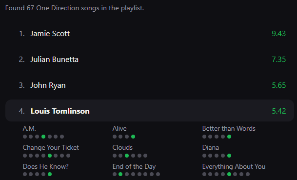
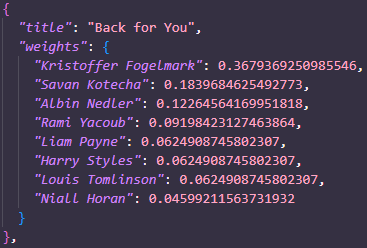

# Who probably wrote on it?
**Louis Tomlinson once tweeted,** "And remember if it's by one direction and it's a banger I probably wrote on it," a claim intuitively possible but statistically more difficult to prove.  Plus, when everybody was vocal about who they thought wrote the best songs in the band, I wondered if their actual listening behaviour would align with their stated opinions. So I made this site to settle the arguments once and for all.  Of course, the definition of banger may change from person to person, so this allows people to certify their own bangers and learn exactly who we have to thank for their excellence.

Users can use their liked songs, or a specific playlist to represent their taste.  The ranked list of writers is displayed with their points, and users wondering why their list looks like it does can click the names to see which songs they have contributed to and where they are positioned in those writing credits.

There are aria labels on the dot diagrams saying '5th of 6 writers' etc. for screenreader legibility.

### Points System

Contribution points for each song are pre-computed in two json files, one with and one without other songwriters.  This can change the order among the band members significantly, as someone who co-wrote many songs could do well on the band-only setting but if their name only appears after 3 or 4 other co-writers, they would be beaten out in the full list by someone who contributed to fewer songs but was listed first.  

The order in which songwriters are credited normally signifies that the first names contributed more.  This points system uses harmonic weighting and gives a total of 1 point to all the writers, which gets divided by the total number of writers and descends as it goes along.  *However*, in many (but not all) cases the contributing members of One Direction get listed beside each other in alphabetical order, which seems to signify their contributions were more or less even.  In calculating my weights, if two or more members were listed beside each other alphabetically, I considered that a tie.  

Here is an example, Horan is credited last despite being first alphabetically which can be interpreted to mean he contributed least, but the same can't be inferred from the order of the first three; they are awarded equal points.

### More info

GitHub Pages deploys the static frontend in `docs/`, with the song data and scoring logic bundled in the site. A separate Cloudflare Worker in `worker/` acts as a secure Spotify token proxy, holding the client secret. The Worker is deployed with Wrangler.
